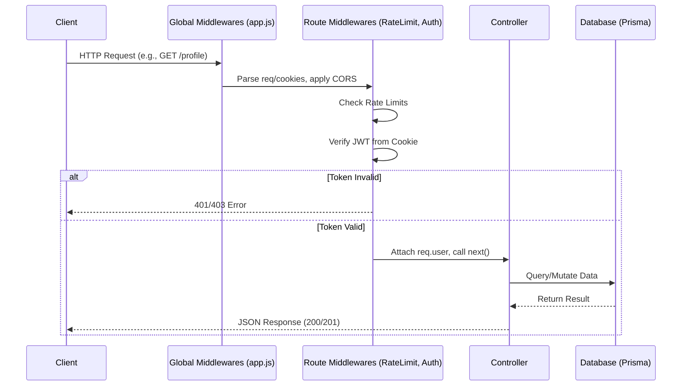
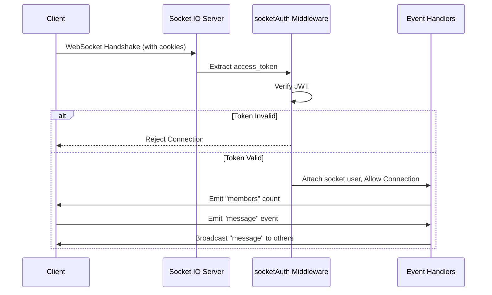

# Backend Microservice - API & Token Documentation

This document outlines the authentication flow, token payloads, and the expected request/response structures for the backend microservice. It details exactly what is required in the requests ("What you are asking") and what the server returns ("What you are getting").

---

## 1. Token Structures (JWT)

The system uses three types of JWTs to manage authentication and registration states securely. All tokens are transmitted via **HttpOnly cookies**.

### 1.1 `session_token` (Registration Flow)
Used temporarily during the signup process to keep track of the user's OTP verification state.
* **Payload**: 
  ```json
  {
    "email": "user@example.com",
    "username": "johndoe",
    "isVerified": false // or true after OTP verification
  }
  ```
* **Lifespan**: 5 minutes (if `isVerified: false`), 15 minutes (if `isVerified: true`).

### 1.2 `access_token` (Main Authentication)
Used to authenticate standard API requests after a successful login or registration.
* **Payload**:
  ```json
  {
    "userId": "cuid_string_from_db",
    "username": "johndoe",
    "type": "user"
  }
  ```
* **Lifespan**: 15 minutes.

### 1.3 `refresh_token` (Session Persistence)
Used to automatically fetch a new `access_token` when it expires, keeping the user logged in without requiring them to re-enter their password.
* **Payload**: Same as `access_token` (`userId`, `username`, `type`).
* **Lifespan**: 30 days.
* **Security Note**: A SHA256 hashed version is stored in the database (`hashedRefreshToken`) to allow the server to revoke sessions (e.g., on logout).

---

## 2. Authentication Endpoints

### 2.1 Send OTP (Start Registration)
**`POST /api/auth/send-otp`**

* **What you are asking (Request Body)**:
  ```json
  {
    "username": "johndoe",
    "email": "user@example.com"
  }
  ```
* **What you are getting (Response)**:
  * **Success (200)**: `{ "success": true, "message": "OTP sent successfully" }` *(Sets `session_token` cookie)*
  * **Error (409)**: `{ "field": "username", "error": "USERNAME_ALREADY_EXISTS" }`
  * **Error (429)**: `{ "error": "RATE_LIMIT: PLEASE_WAIT_BEFORE_REQUESTING_NEW_OTP" }`

### 2.2 Verify OTP
**`POST /api/auth/verify-otp`**

* **What you are asking (Request)**:
  * **Body**: `{ "otp": "123456" }`
  * **Cookie**: Requires `session_token`
* **What you are getting (Response)**:
  * **Success (200)**: `{ "success": true, "message": "IDENTITY_VERIFIED" }` *(Updates `session_token` cookie to `isVerified: true`)*
  * **Error (400)**: `{ "success": false, "error": "ACCESS_DENIED: TOKEN_MATCH_FAILED" }`

### 2.3 Complete Registration
**`POST /api/auth/register`**

* **What you are asking (Request)**:
  * **Body**: `{ "password": "securepassword123" }`
  * **Cookie**: Requires `session_token` (with `isVerified: true`)
* **What you are getting (Response)**:
  * **Success (201)**: `{ "message": "USER_REGISTERED_SUCCESSFULLY", "user": { "username": "johndoe" } }` *(Sets `access_token` & `refresh_token` cookies)*
  * **Error (400)**: `{ "error": "VALIDATION_ERROR: PAYLOAD_INVALID", "details": [...] }`

### 2.4 Login
**`POST /api/auth/login`**

* **What you are asking (Request Body)**:
  ```json
  {
    "email": "user@example.com",
    "password": "securepassword123"
  }
  ```
* **What you are getting (Response)**:
  * **Success (200)**: `{ "message": "LOGIN_SUCCESSFUL", "user": { "username": "johndoe" } }` *(Sets `access_token` & `refresh_token` cookies)*
  * **Error (401)**: `{ "error": "AUTH_ERROR: INVALID_CREDENTIALS" }`

### 2.5 Refresh Session
**`POST /api/auth/refresh`**

* **What you are asking (Request)**:
  * **Cookie**: Requires `refresh_token`
* **What you are getting (Response)**:
  * **Success (200)**: `{ "message": "SESSION_ACCESS_RENEWED" }` *(Sets new `access_token` cookie)*
  * **Error (403)**: `{ "message": "User session node untethered" }` (or invalid token)

### 2.6 Logout
**`POST /api/auth/logout`**

* **What you are asking (Request)**:
  * **Cookie**: Requires `refresh_token` (to invalidate it in the database)
* **What you are getting (Response)**:
  * **Success (200)**: `{ "message": "SESSION_TERMINATED: GOODBYE_OPERATOR" }` *(Clears all auth cookies)*

---

## 3. User Endpoints

### 3.1 Get Current User (Me)
**`GET /api/users/me`**

* **What you are asking (Request)**:
  * **Cookie**: Requires valid `access_token`
* **What you are getting (Response)**:
  * **Success (200)**: 
    ```json
    {
      "username": "johndoe"
    }
    ```

### 3.2 Get User Profile
**`GET /api/users/profile`**

* **What you are asking (Request)**:
  * **Cookie**: Requires valid `access_token`
* **What you are getting (Response)**:
  * **Success (200)**: 
    ```json
    {
      "success": true,
      "profile": {
        "username": "johndoe",
        "email": "user@example.com",
        "createdAt": "2026-07-16T12:00:00.000Z",
        "isVerified": true,
        "savedAPI": null,
        "stats": {}
      }
    }
    ```

---

## 4. Developer & System Endpoints

### 4.1 API Definitions (`/api`)
Used to fetch or register new API endpoint definitions dynamically.
* **GET `/api`**: Returns a list of all registered APIs.
* **POST `/api`**: Registers a new API instance (Requires `writeLock` middleware).
* **DELETE `/api/:id`**: Deletes an API definition by ID (Requires `writeLock` middleware).

### 4.2 API Configuration (`/config`)
* **GET `/config/api/:id`**: Fetches the configuration data for a specific API by ID. Returns `404` if not found.

### 4.3 Runtime Products & Services (`/runtime`)
These endpoints simulate real production data and have strict rate-limiting (`runtimeLimiter` - 5 requests per minute) and require an API token (`API_Token_Verify`).
* **GET `/runtime/products`**: Fetch all products.
* **GET `/runtime/products/random/:limit`**: Fetch a random set of products up to a limit.
* **GET `/runtime/products/:id`**: Fetch a specific product by ID.

---

## 5. Socket.IO Endpoints & Events

The backend uses Socket.IO for real-time communication. All socket connections require an active `access_token`.

### 4.1 Connection & Authentication
**`ws://<server_url>/`**

* **What you are asking (Connection Request)**:
  * **Cookie**: Requires a valid `access_token` via standard HTTP cookies during the initial handshake.
* **What you are getting (Connection Response)**:
  * **Success**: The socket connects, and the server attaches the decoded user payload to the socket session (`socket.user`).
  * **Error**: Disconnection with `Authentication Error.` or `Invalid token` if the cookie is missing or invalid.

### 4.2 Emitted Events (What the server sends to the client)
* **`members`**: Broadcasts the total number of currently connected sockets. Emitted on every new connection and disconnection.
  * **Payload**: `Integer` (e.g., `5`)

* **`message`**: Broadcasts messages received from one client to all other connected clients.
  * **Payload**: Whatever data was originally sent by the client.

### 4.3 Listened Events (What the server expects from the client)
* **`message`**: The server listens for this event from a connected client.
  * **What you are asking (Client Emits)**: `socket.emit("message", { text: "Hello World" })`
  * **What you are getting (Server Action)**: The server logs the message and uses `socket.broadcast.emit("message", data)` to send it to everyone else.

---

## 6. Overall Request Workflow

Here is the step-by-step lifecycle of how requests are handled in this microservice:

### 6.1 Express HTTP Request Workflow



1. **Client Request**: The client sends an HTTP request to an endpoint (e.g., `GET /api/users/profile`).
2. **Global Middlewares**: The request passes through global middlewares in `app.js` (like `cors`, `helmet`, `express.json()`, `cookieParser()`, etc.).
3. **Route-Specific Middlewares**:
   * **Rate Limiting**: For auth routes, `express-rate-limit` checks if the IP has exceeded request limits.
   * **Authentication**: If the route is protected, a token middleware runs (e.g., `verifyToken` or `verifySessionToken`). It reads the specific HttpOnly cookie, verifies the JWT using the `SECRET_KEY`, and attaches the decoded payload to `req.user`. If verification fails, it aborts and returns a 401/403 error.
4. **Controller Logic**: The request reaches the specific controller (e.g., `userController.js`). The controller validates input, interacts with the PostgreSQL database (via Prisma), and processes the business logic.
5. **Response**: The controller formats the data and sends a JSON response back to the client.

### 6.2 Socket.IO Request Workflow



1. **Client Connection Request**: The client attempts to establish a WebSocket connection via Socket.IO.
2. **Handshake & Cookie Parsing**: The Socket.IO server (`initSocket`) intercepts the HTTP handshake. It uses `cookieParser()` to parse cookies from the handshake headers.
3. **Socket Authentication Middleware**: The `socketAuth` middleware runs. It extracts the `access_token` from `socket.request.cookies`.
   * **If valid**: It verifies the JWT, attaches the user data to `socket.user`, and calls `next()` to allow the connection.
   * **If invalid/missing**: It calls `next(new Error(...))` and the connection is rejected.
4. **Connection Established**: Once authenticated, the `connection` event fires in `registerSocketHandler`.
5. **Event Handling**: 
   * The server immediately emits the `"members"` event to update all clients on the active user count.
   * The server registers event listeners for this specific socket (like `"message"` and `"disconnect"`).
6. **Real-time Communication**: The client and server can now freely emit and listen to events in real-time. If the socket disconnects, the server cleans up and broadcasts the updated `"members"` count.
