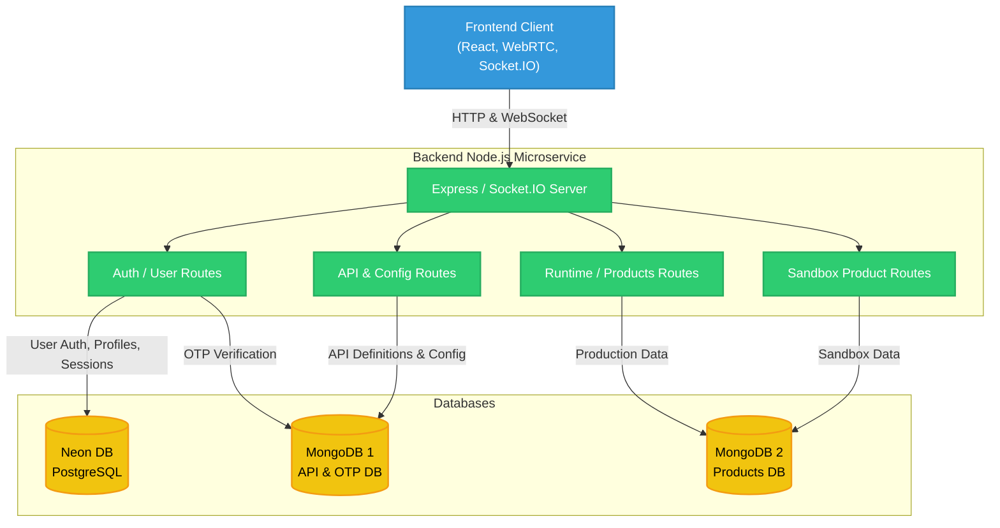
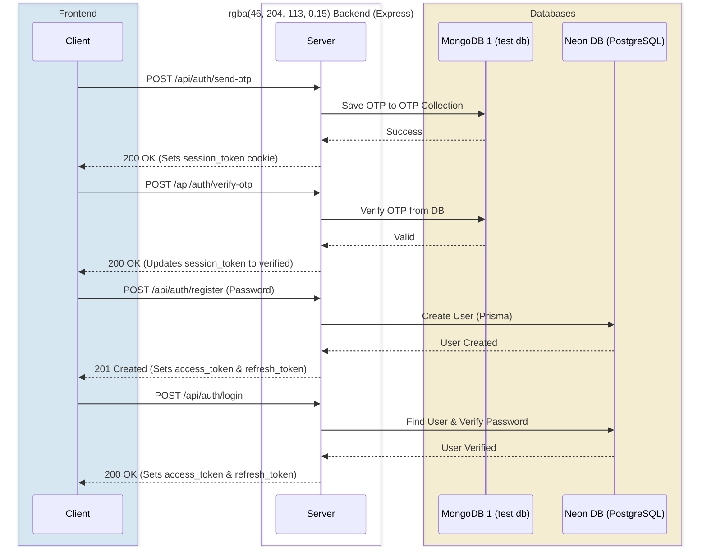
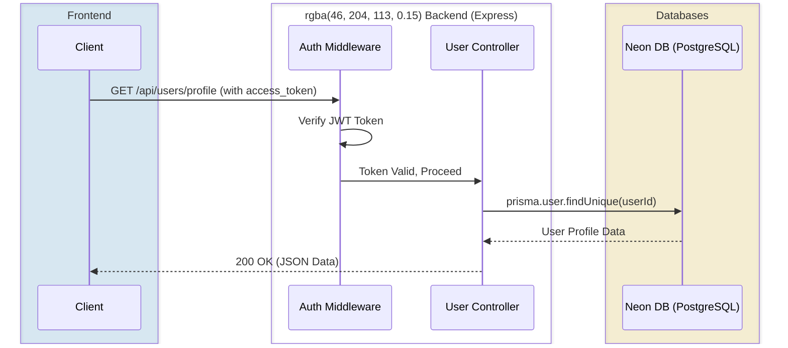
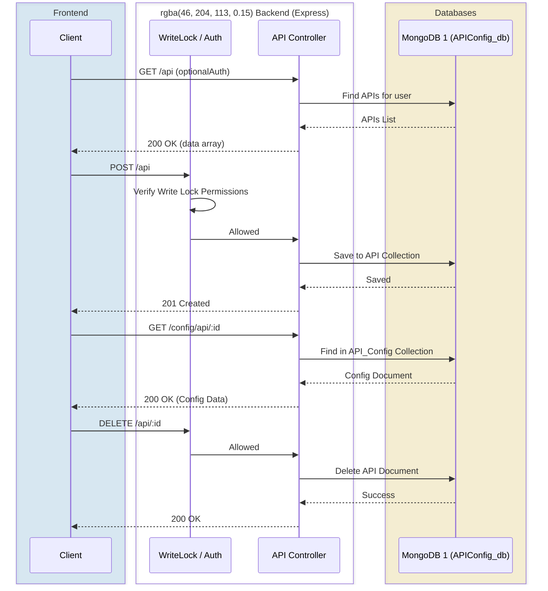
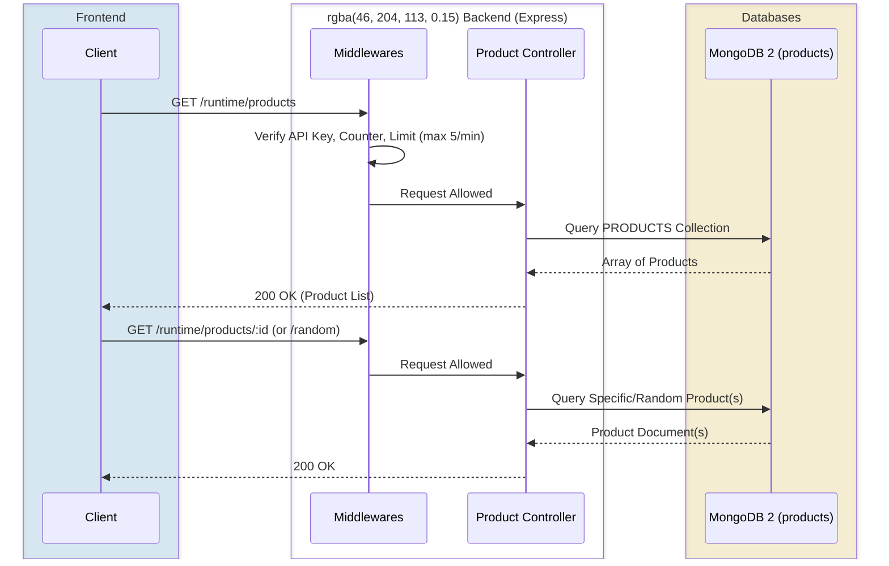
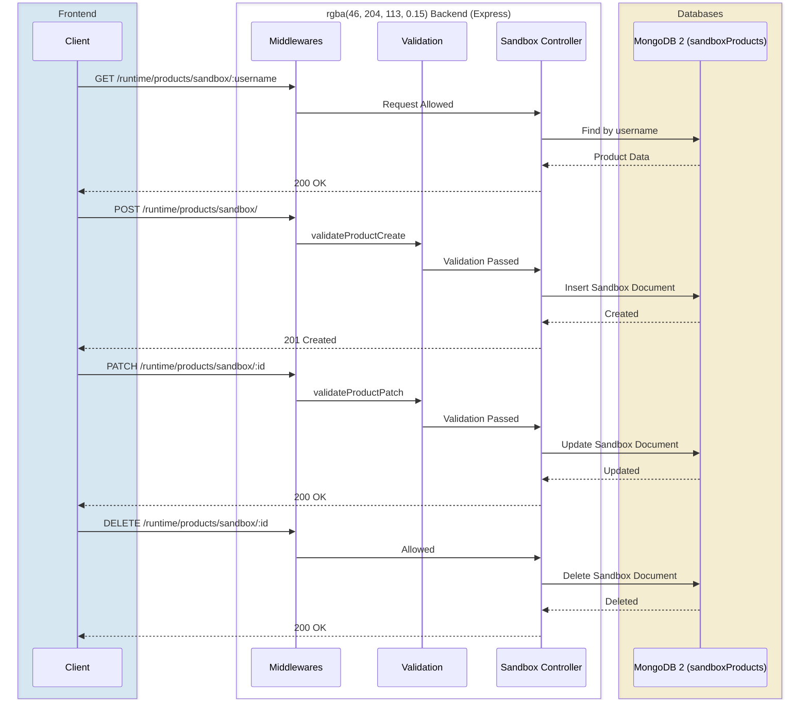
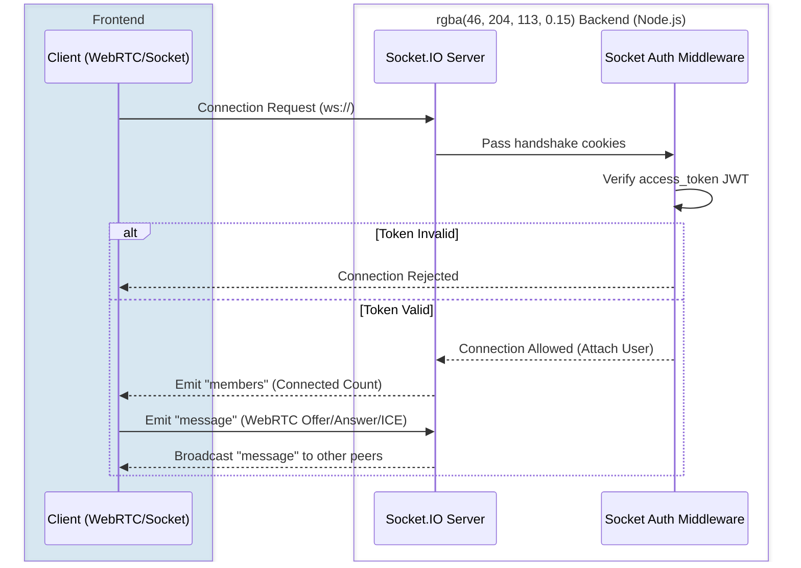

# System Architecture and Request Flows

This document visualizes the entire request flow for the microservice architecture, including the Frontend, Backend, and multiple database instances (Neon PostgreSQL and two MongoDB instances).

## 1. Overall System Architecture

This diagram illustrates the macro-level architecture showing how the Frontend connects to the Backend, and how the Backend routes requests to the appropriate databases.

## 2. Request Flows by Module

### 2.1 Authentication & Registration Flow

The registration and authentication flow uses both **MongoDB 1** (for temporary OTP storage) and **Neon DB (PostgreSQL)** (for permanent user records and session management).

### 2.2 User Profile Flow

User-related data is completely handled by **Neon DB**.

### 2.3 API Definition & Configuration Flow

API definitions and configs are stored in **MongoDB 1** (specifically `APIConfig_db`). 

### 2.4 Runtime & Products Flow (Read-Only)

Production product data is read-only and is fetched from **MongoDB 2** (`products` database). Includes multiple middlewares like `API_Token_Verify` and `runtimeCounter`.

### 2.5 Sandbox Products Flow (CRUD)

Sandbox products allow creation, deletion, and updates, and are fetched from **MongoDB 2** (`sandboxProducts` database).

### 2.6 Real-time WebSocket Flow (Socket.IO & WebRTC Signaling)

Socket connections are authenticated using the `access_token` cookie. Once authenticated, they communicate entirely in memory unless a specific event writes to a database. Since the frontend is using WebRTC, this socket connection acts as the signaling server.

